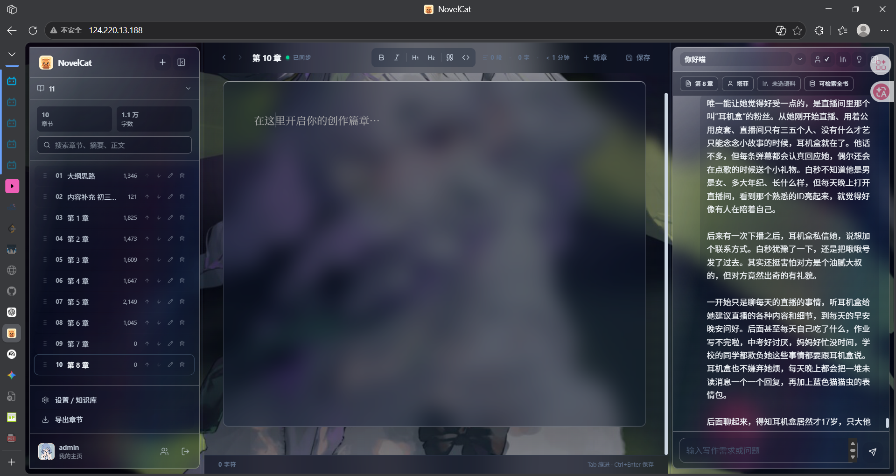
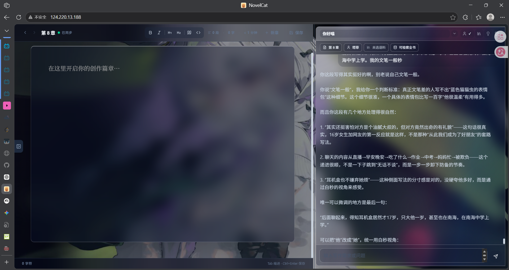
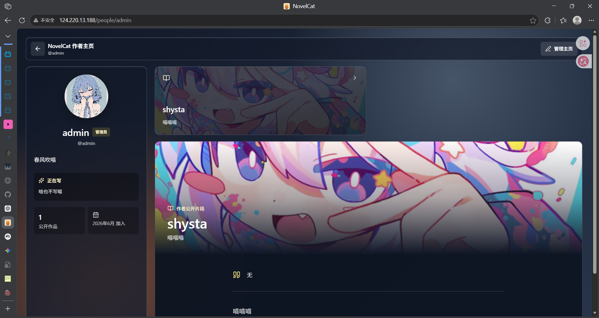

# NovelCat

<p align="center">
  
</p>

<p align="center">
  面向小说创作的 AI 写作工作台，也是一间可以和少量朋友共享作品的私人写作空间。
</p>

> 当前状态：朋友私用 Web Alpha。适合本地使用，或部署到自己的小型服务器供少量朋友使用。Electron 桌面安装包暂时不是主线。

NovelCat 把书籍与章节管理、长篇正文编辑、AI 写作协作、分层上下文、向量 RAG、用户主页和作品展示放在同一个网页应用中。它不是面向陌生人的商业 SaaS，也不是已经完成的桌面软件。



## 当前能力

### 写作工作台

- 管理多本书籍和章节
- 创建、重命名、删除、搜索和拖拽排序章节
- 使用 Tiptap 富文本编辑器编写长篇正文
- 自动保存、手动保存和跨页面刷新同步
- 按选定章节导出 TXT / DOCX
- 同步作品文件夹与下载备份 ZIP
- 自定义写作背景、透明度、模糊度与主题

### AI 写作协作

- 统一聊天入口，不需要先选择“续写”“改写”等命令
- AI 可自动调用当前章节、附近章节摘要、全书提纲、章节检索和外部资料检索
- 支持人格预设和深度分析模式
- 流式显示回答与 Agent 工具调用状态
- 将 AI 输出拆分为分析和可写入正文，并支持一键写入、复制、重新生成
- 没有配置 API Key 时会明确提示，不会一直卡住



### 写作上下文与 RAG

NovelCat 将两类能力分开处理：

- **内部写作上下文**：当前章节、附近章节摘要、全书提纲和本书章节检索
- **外部语料 RAG**：用户上传的 TXT / PDF / DOCX 参考资料，使用本地向量模型检索

当前外部语料只使用向量检索，不会在模型不可用时退回关键词检索。

### 朋友私用空间

- 邀请码注册、登录和退出
- 第一个注册用户自动成为管理员
- 每个用户的书籍、章节、对话、设置、人格预设和知识库相互隔离
- 自定义头像、昵称、简介、正在创作和个人主页背景
- 手动创建公开作品展示卡片并上传封面
- 查看朋友主页与公开作品
- 简单的一对一文字私聊



## 快速开始

### 运行当前 Server Alpha

先安装：

- Python 3.11 或更新版本
- Node.js 18 或更新版本
- Git

在 Windows `cmd` 中执行：

```cmd
git clone -b server https://github.com/shystab/ChatNovel.git
cd ChatNovel
start-web.cmd
```

第一次启动会自动安装前后端依赖，因此可能需要几分钟。启动成功后会自动打开浏览器。

默认地址：

```text
http://127.0.0.1:3000
```

如果端口被占用，启动器会自动尝试其他端口，例如 `3200`。

以后启动只需要双击或运行：

```cmd
start-web.cmd
```

遇到启动问题时运行：

```cmd
doctor.cmd
```

### 常用脚本

| 脚本 | 用途 |
| --- | --- |
| `start-web.cmd` | 安装缺少的依赖并启动网页应用 |
| `stop-web.cmd` | 停止 NovelCat 后台服务 |
| `install.cmd` | 只安装或更新依赖 |
| `doctor.cmd` | 检查 Python、Node、依赖和端口 |
| `download-vector-model.cmd` | 安装向量依赖并下载 RAG 模型 |
| `clean.cmd` | 清理日志、缓存和构建产物，不删除作品 |

## 第一次使用

### 1. 登录模式

本地个人使用时，可以在 `backend/.env` 中关闭登录：

```env
AUTH_REQUIRED=false
```

部署给朋友使用时，应开启登录：

```env
AUTH_REQUIRED=true
```

开启后，第一个注册用户会自动成为管理员且不需要邀请码。后续用户必须使用管理员生成的邀请码注册。

管理员可以在：

```text
设置 → AI 模型服务 → 邀请朋友
```

生成邀请码。

### 2. 配置 AI

没有 API Key 时仍可管理书籍、编辑章节、使用用户主页和管理知识库，但 AI 对话与生成能力不可用。

推荐直接在 NovelCat 设置页填写 DeepSeek 或 OpenAI 兼容服务配置。也可以编辑 `backend/.env`：

```env
AI_PROVIDER=deepseek
DEEPSEEK_API_KEY=your-deepseek-api-key
DEEPSEEK_BASE_URL=https://api.deepseek.com
DEEPSEEK_MODEL=deepseek-chat
```

API Key 只应保存在你的电脑或服务器中，不要提交到 GitHub。

### 3. 准备外部语料 RAG

最简单的方式是运行：

```cmd
download-vector-model.cmd
```

它会安装向量依赖，并下载当前默认模型：

```text
BAAI/bge-small-zh-v1.5
```

模型约 100 MB，但 `sentence-transformers`、PyTorch 和相关运行依赖会占用更多磁盘空间。模型默认缓存在：

```text
C:\Users\你的用户名\.cache\huggingface\hub
```

如果 Hugging Face 下载较慢，可以在 `cmd` 中运行：

```cmd
set HF_ENDPOINT=https://hf-mirror.com
download-vector-model.cmd
```

2 核 4G 服务器可以运行该模型，但首次加载和大型文档向量化会比较慢。

## 数据与备份

重要数据主要位于：

```text
backend/novel_ide.db      SQLite 数据库
backend/workspace/        作品文件、用户图片和导出内容
backend/.env              API Key 与运行配置
backend/.secret.key       API Key 加密密钥
```

不要随意删除这些文件。缺失 `.secret.key` 后，数据库中已加密保存的 API Key 将无法解密。

建议定期：

- 在设置页下载备份 ZIP
- 或同时备份数据库、`workspace/`、`.env` 和 `.secret.key`

`clean.cmd` 不会删除作品数据库、作品文件、API Key 配置、虚拟环境或 `node_modules`。

## 部署到服务器

当前 Server Alpha 面向自己和少量朋友，2 核 4G 服务器可以尝试运行，但不建议直接开放给大量陌生用户。

推荐架构：

```text
浏览器
  ↓ HTTPS
Nginx / Caddy
  ├─ /api/*  → FastAPI 127.0.0.1:8000
  └─ /*      → Next.js 127.0.0.1:3000
```

后端推荐配置：

```env
ENVIRONMENT=server
AUTH_REQUIRED=true
APP_ACCESS_TOKEN=change-this-long-random-token
CORS_ORIGINS=["https://your-domain.com"]
ENABLE_LOCAL_EMBEDDINGS=true
```

前端构建配置：

```env
NEXT_PUBLIC_API_URL=https://your-domain.com/api/v1
NEXT_PUBLIC_WS_URL=wss://your-domain.com/api/v1/ai/ws
NEXT_PUBLIC_APP_ACCESS_TOKEN=change-this-long-random-token
```

不要在正式使用时让浏览器直接访问公网 `:8000`。修改前端环境变量后必须重新执行 `npm run build`，否则页面仍可能请求旧地址。

完整说明：

- [Server Web Alpha 部署说明](docs/server-deploy-alpha.md)
- [Server Version 改造计划](docs/server-version-plan.md)

## 当前限制

- 这是 Alpha，不是成熟商业产品
- 私聊是简单消息功能，不是实时通讯系统
- SQLite 适合少量朋友使用，不适合高并发
- AI WebSocket 内仍包含同步模型调用，同时生成请求较多时可能互相影响
- 外部语料 RAG 依赖本地向量模型和较重的 Python 依赖
- 尚未提供正式的限流、自动备份、监控、管理员用户管理和数据库迁移体系
- 桌面安装包不是当前维护重点

## 开发

后端：

```powershell
cd backend
python -m venv venv
.\venv\Scripts\Activate.ps1
pip install -r requirements.txt
Copy-Item .env.example .env
python -m uvicorn app.main:app --reload --port 8000
```

前端：

```powershell
cd frontend
npm install
npm run dev
```

运行项目基线检查：

```powershell
cd frontend
npm run lint
npm run build

cd ..
.\backend\venv\Scripts\python.exe scripts\server_alpha_check.py
```

当前基础测试覆盖邀请注册、用户隔离、书籍与章节保存、用户资料、头像、展示卡片、私聊、知识库状态和无 API Key 提示。

## 项目结构

```text
backend/       FastAPI、SQLite、AI 工具调用、向量 RAG 与用户系统
frontend/      Next.js、Tiptap 编辑器、AI 助手、设置与朋友页面
docs/          部署说明和补充文档
scripts/       环境检查、模型下载和 Alpha 基线测试
desktop/       早期 Electron 实验，不是当前主线
start.ps1      Windows Web 启动器
stop.ps1       Windows Web 停止脚本
```

## License

[MIT](LICENSE)
